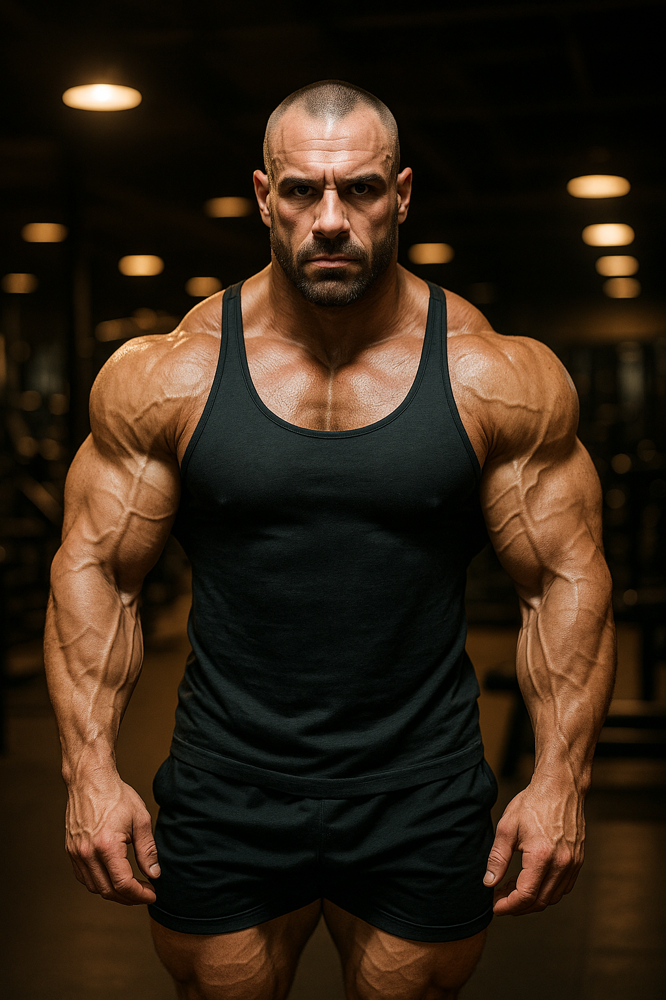

# Título do Projeto Extremamente Aesthetic ;)
Natty or Not: Desafio de Hiper-Realismo com Imagem de Fisiculturista

## 📒 Descrição
Este projeto foi desenvolvido como parte do Lab "Natty or Not" da DIO, focado em explorar o potencial das IAs Generativas para criar conteúdo visual hiper-realista. A tarefa foi gerar uma imagem de fisiculturista que fosse difícil de distinguir de uma fotografia profissional, utilizando o Gemini como ferramenta principal.

## 🤖 Tecnologias Utilizadas
1. **Gemini (IA Generativa de Imagem):** Utilizado para gerar a imagem com base em comandos de texto (Prompt Engineering).
2. **GitHub:** Plataforma para hospedagem do portfólio e do arquivo README.md.

## 🧐 Processo de Criação
1. **Definição do Conceito:** O objetivo era criar uma imagem que simulasse uma foto de estúdio de alta qualidade no universo do fisiculturismo.
2. **Prompt Engineering:** Para garantir o máximo de realismo, utilizei especificadores técnicos na linguagem da fotografia.
   * **Prompt Utilizado:** "Um fisiculturista hiper-realista em uma academia, iluminação cinematográfica, 8k, foto de estúdio"
3. **Geração e Seleção:** O Gemini processou o prompt, e o resultado foi uma imagem com alta saturação e detalhes.

## 🚀 Resultados

A imagem gerada pelo Gemini pode ser visualizada abaixo (ou no link direto, caso a visualização não carregue devido a limitações de hospedagem):

[Ver a Imagem Gerada Aqui](COLE_O_LINK_PÚBLICO_DA_IMAGEM_AQUI)

A imagem final alcançou um alto nível de detalhe na pele e na musculatura, embora a IA ainda possa apresentar pequenos artefatos ou inconsistências em áreas complexas (como mãos e rostos), o que levanta a questão do "Natty or Not" (Natural ou Não).

## 💭 Reflexão
O principal aprendizado deste desafio foi a importância do **Prompt Engineering**. Percebi que o sucesso da IA Generativa está diretamente ligado à clareza e riqueza dos comandos fornecidos.

Ao usar termos específicos como **"hiper-realista"**, **"iluminação cinematográfica"** e **"foto de estúdio"**, consegui direcionar a IA a simular um trabalho profissional, e não apenas um desenho ou renderização. Isso demonstra que a capacidade de "falar a linguagem" da arte ou da fotografia com a IA é fundamental para atingir resultados que desafiam o olho humano. O modelo Gemini provou ser eficiente, mas a curadoria do prompt é a verdadeira habilidade humana na era da IA Generativa.
